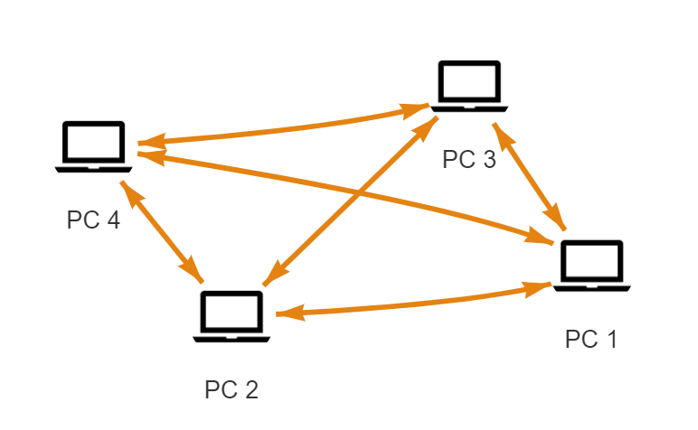

# P2PNetworkBuilder

<p align="center">
    
</p>

<p align="center">
    <a href="https://github.com/piotrek-k/P2PNetworkBuilder" alt="Badge with build status">
        </a>
    <a href="https://www.nuget.org/packages/P2PNetworkBuilder/" alt="Version on NuGet">
        </a>
    <a href="https://www.nuget.org/packages/P2PNetworkBuilder/" alt="Pre-prelease on Nuget">
        </a>
</p>

`P2PNetworkBuilder` is a tool that provides a framework for creating networks of devices in Peer-to-peer manner. Is such networks, all devices are connected to each other. You can use it as a backbone of decentralized systems.

Key features:

* Uses UDP Hole Punching technique to connect devices hidden behind NATs
* Provides end-to-end encryption of sent message's content
* Uses public-key cryptography to exchange keys
* Operates on custom UDP based Internet protocol which ensures packet delivery in correct order

## Minimal example

All you need to do to set up network node is to create `NetworkController` instance and port listener:

```csharp
INetworkController network = new NetworkManagerFactory().Create();

network.StartListening(1234);
```

Now, device listens for incoming packets on specified port. External device can connect to it via `ConnectManually` command:

```csharp
IExternalNode node = network.ConnectManually(new IPEndPoint(IPAddress.Parse("127.0.0.1"), 1234));
```

All nodes exchange information about other network memebers with each other. That means you need to connect to only one node, others will appear automatically.

You can easily iterate over all network nodes, check their Id and status:

```csharp
foreach (var node in network.Nodes)
{
    Console.WriteLine($"{n.Id} \t" +
        $" {Enum.GetName(typeof(ExternalNode.ConnectionState), n.CurrentState)} \t" +
        $" {n.CurrentEndpoint}");
}
```

You can also send byte arrays to each node:

```csharp
n.SendBytes(1234, new byte[] { 1, 2, 3, 4 }, (result) =>
    {
        // this code executes after receving acknowledge that message was delivered 
        if(result == AckStatus.Success){
            // message processed successfully
        }
        else {
            // external node reported error while processing this message
        }
    });
```
